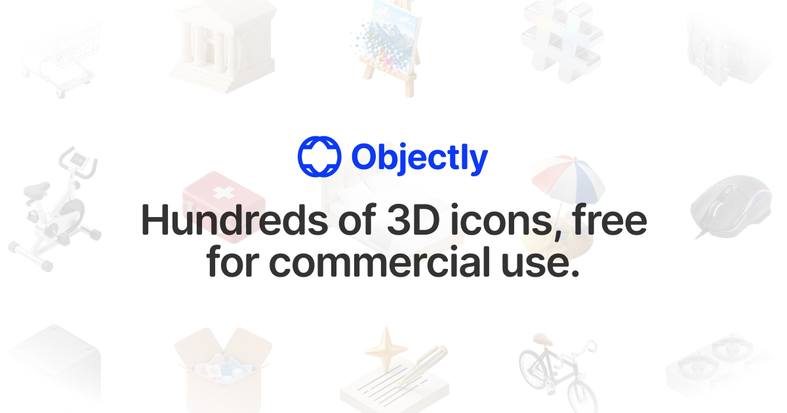

<p align="center">
  
</p>

<h1 align="center">Objectly</h1>

<p align="center">
  A free, premium 3D icon library — 240 icons across 10 packs, on an infinite browsable grid.<br />
  <strong>Free for commercial use. Attribution appreciated, not required.</strong>
</p>

<p align="center">
  <a href="https://objectly.co">objectly.co</a> ·
  <a href="https://x.com/pixelyokai">@pixelyokai</a>
</p>

---

## What it is

Objectly is a browsable grid of 3D-rendered icons, organised into category packs. The grid
tiles infinitely in every direction, search and category filters narrow it live, and any icon
can be downloaded at full resolution from a drawer.

**Packs:** AI · Ecommerce · Finance · Fitness & Sports · Gaming & Devices · Healthcare ·
Home & Living · Marketing & Growth · Security & Privacy · Travel & Hospitality

## Highlights

- **Infinite grid** — a finite icon set tiled by modulo lookup, so filtering just swaps the
  array and the same mechanism keeps working. 60fps under a fast drag.
- **Zero-config content** — drop a PNG into a pack folder, restart, and it appears. Packs,
  the categories dropdown, and the download route all derive from a generated manifest.
- **One motion language** — every animation pulls its spring from `src/lib/motion.ts`, and
  every animated component honours `prefers-reduced-motion`.
- **Lean payload** — 155kB of gzipped JS and 57kB of subset fonts, with icons served at
  preview resolution and cached at the edge.

## Tech stack

Vite · React · TypeScript · Tailwind CSS · [Motion](https://motion.dev) ·
[vaul](https://vaul.emilkowal.ski) · [Lenis](https://lenis.dev) ·
[lucide-animated](https://lucide-animated.com) · [ThiingsGrid](https://github.com/charlieclark/thiings-grid)
Deployed on Cloudflare Workers (with static assets) and R2.

## Local development

```bash
npm install
npm run dev          # UI only
npm run worker:dev   # app plus the download route, running as it does in production
```

Source icons live in `Assets/Images/<Pack Name>/<Icon Name>.png` and are **not committed** —
they are 2048px masters totalling ~258MB. Dev generates and caches a downscaled preview tier
on first request in `node_modules/.cache/objectly-preview/`. Delete that folder to regenerate.

| Script | What it does |
| --- | --- |
| `npm run dev` | Vite dev server (regenerates manifests first) |
| `npm run worker:dev` | Build then `wrangler dev`, with R2 bindings live |
| `npm run build` | Type-check and build to `dist/` |
| `npm run generate:icons` | Rebuilds the manifests from `Assets/Images/` |
| `npm run prepare:assets` | Writes the upload-ready asset tree; never touches sources |
| `npm run check:descriptions` | Lists manifest ids missing a description |
| `npm run subset:fonts` | Regenerates the Latin-subset woff2 files |

## Architecture notes

**Manifests are generated, never hand-edited.** `scripts/generate-manifest.mjs` scans
`Assets/Images/` and emits the typed manifests the app and the download route read from.
Rename or add a file and the manifests follow; nothing is maintained by hand.

**Descriptions are authored, not generated at runtime.** All 240 live in
`src/data/descriptions.ts`, so no API is called to render an icon. A missing id falls back to
a neutral template rather than an empty gap; `npm run check:descriptions` reports gaps.

**Fonts.** Only weights 400 and 500 are referenced, so only those ship, Latin-subset —
636kB → 57kB. All four full weights remain in `Assets/OpenRunde/`. To use another weight, add
it to `WEIGHTS` in `scripts/subset-fonts.mjs`, re-run `npm run subset:fonts`, and add a
matching `@font-face` rule in `src/index.css`.

## Security posture

The site runs on a workers.dev subdomain rather than a custom domain, which
means zone-level Cloudflare products (Bot Fight Mode, managed WAF rules,
rate limiting rules) are not available — those require a domain added to your
account as a zone.

The protection that mattered most for this project is enforced in the Worker
instead: `/api/download` is rate limited to 20 requests per minute per IP via
a Workers rate limiting binding, which applies regardless of how the site is
reached. The preview tier is deliberately left unlimited, because fast grid
panning fires many image requests at once and a numeric threshold there would
false-positive real users.

If a custom domain is added later, the zone-level features become available and
can layer on top of this without changing any code.

## Licence

Icons are free for commercial use; attribution appreciated, not required.
[Open Runde](https://github.com/lauridskern/open-runde) is OFL-1.1. This repository is
private and unlicensed for reuse; the MIT notices for bundled runtime dependencies
(React, Motion, vaul, Lenis) are in [NOTICE.md](NOTICE.md), shipped at `/NOTICE.md`
on the deployed site since MIT requires the notice travel with the distributed code.
